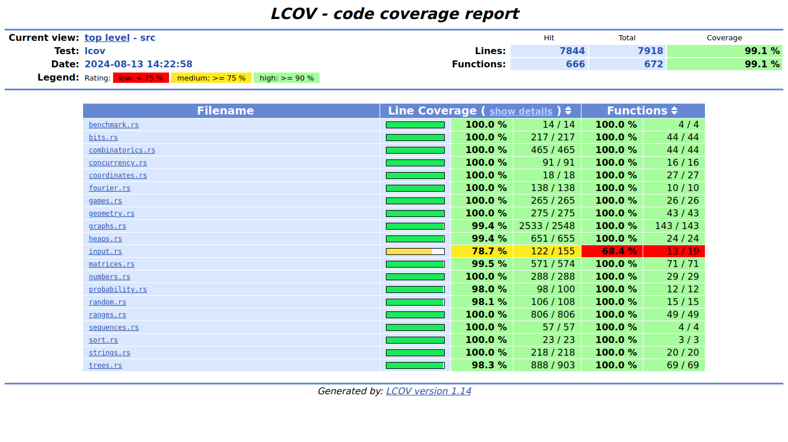

= Development

Build for Linux (on Linux):
[source,shell]
----
# 64-bit (Intel and AMD)
rustup target add x86_64-unknown-linux-gnu
cargo build --target x86_64-unknown-linux-gnu --release

# 32-bit (Intel and AMD)
rustup target add i686-unknown-linux-gnu
cargo build --target i686-unknown-linux-gnu --release
----

Build for Windows (on Linux):
[source,shell]
----
# 64-bit (Intel and AMD)
rustup target add x86_64-pc-windows-gnu
sudo apt install gcc-mingw-w64-x86-64
cargo build --target x86_64-pc-windows-gnu --release

# 32-bit (Intel and AMD)
rustup target add i686-pc-windows-gnu
sudo apt install gcc-mingw-w64-i686
cargo build --target i686-pc-windows-gnu --release
----

Build for MacOS (on Linux):
[source,shell]
----
curl -L https://github.com/roblabla/MacOSX-SDKs/releases/download/13.3/MacOSX13.3.sdk.tar.xz | tar xJ
export SDKROOT=$(pwd)/MacOSX13.3.sdk/
export PATH=$PATH:~/.rustup/toolchains/stable-x86_64-unknown-linux-gnu/lib/rustlib/x86_64-unknown-linux-gnu/bin/

# 64-bit Intel
rustup target add x86_64-apple-darwin
export CARGO_TARGET_X86_64_APPLE_DARWIN_LINKER=rust-lld
cargo build --release --target x86_64-apple-darwin

# 64-bit Apple Silicon (M1, M2 etc.)
rustup target add aarch64-apple-darwin
export CARGO_TARGET_AARCH64_APPLE_DARWIN_LINKER=rust-lld
cargo build --release --target aarch64-apple-darwin
----

Install dependencies for checking code coverage:

[source,shell]
----
cargo install grcov
rustup component add llvm-tools
----

Run code coverage:

[source,shell]
----
make codecov
----

